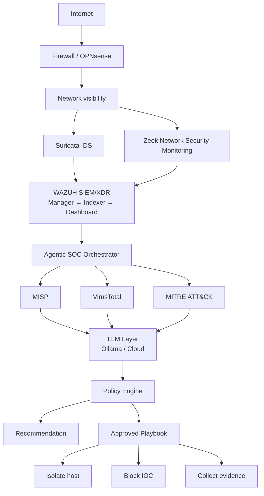
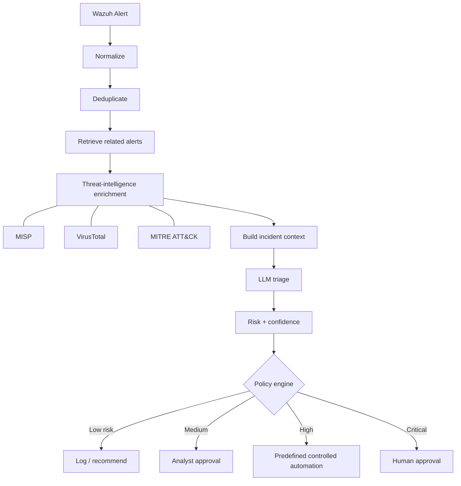
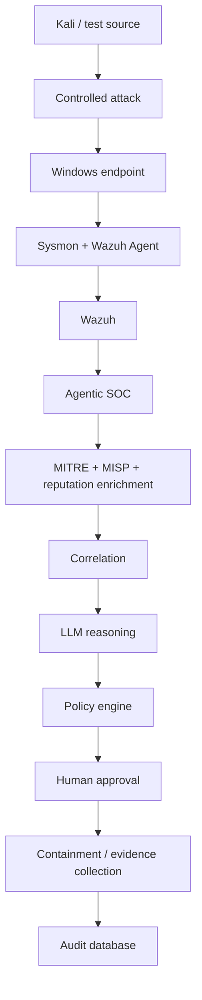

# Low-Cost Agentic SOC — Complete Deployment Blueprint

*Master's Research / Laboratory Deployment Plan*

> Markdown version of [`Low-Cost_Agentic_SOC_Deployment_Blueprint.docx`](Low-Cost_Agentic_SOC_Deployment_Blueprint.docx).
> Where each section is implemented in this repository is noted in *italics* below its heading.

## Contents

1. [Project Objective](#1-project-objective)
2. [Final Architecture](#2-final-architecture)
3. [Recommended Hardware](#3-recommended-hardware)
4. [Virtual Network](#4-virtual-network)
5. [VM Allocation](#5-vm-allocation)
6. [Deployment Order](#6-deployment-order)
7. [Wazuh Deployment](#7-wazuh-deployment)
8. [Endpoint Telemetry](#8-endpoint-telemetry)
9. [Suricata](#9-suricata)
10. [Zeek](#10-zeek)
11. [MISP](#11-misp)
12. [Agentic SOC VM](#12-agentic-soc-vm)
13. [Agent Workflow](#13-agent-workflow)
14. [Multi-Agent Design](#14-multi-agent-design)
15. [Structured LLM Output](#15-structured-llm-output)
16. [Policy Engine](#16-policy-engine)
17. [Response Playbooks](#17-response-playbooks)
18. [PostgreSQL Research Database](#18-postgresql-research-database)
19. [Audit Trail](#19-audit-trail)
20. [LLM Deployment](#20-llm-deployment)
21. [Optional n8n](#21-optional-n8n)
22. [Controlled Attack Scenarios](#22-controlled-attack-scenarios)
23. [End-to-End Demonstration](#23-end-to-end-demonstration)
24. [Evaluation Plan](#24-evaluation-plan)
25. [Cost Model](#25-cost-model)
26. [Suggested Research Contribution](#26-suggested-research-contribution)
27. [Implementation Checklist](#27-implementation-checklist)
28. [Official Technical References](#28-official-technical-references)

---

## 1. Project Objective

Build a resource-efficient Agentic Security Operations Center using open-source SIEM/XDR,
network detection, threat intelligence, LLM-based reasoning, policy-controlled automation, and
auditable incident response.

> **Research question:** Can a resource-constrained agentic SOC improve alert triage,
> correlation, and response efficiency while keeping infrastructure and LLM costs low?

## 2. Final Architecture

*Implemented: see the diagram in the [README](../../README.md) and [docs/architecture.md](../architecture.md).*



## 3. Recommended Hardware

Recommended starting host: **8-core/16-thread CPU, 32 GB RAM, 1 TB NVMe SSD, 1 GbE networking.**
A 64 GB RAM / 2 TB NVMe system gives substantially more room for simultaneous VMs and
packet/log retention. A GPU is optional if running a local LLM.

If a suitable computer already exists, the software stack can be deployed with essentially zero
software licensing cost.

## 4. Virtual Network

*Implemented: [deploy/proxmox](../../deploy/proxmox/README.md).*

| Component | IP | Purpose |
|---|---|---|
| Gateway / Firewall | 192.168.50.1 | Lab gateway |
| Wazuh | 192.168.50.10 | SIEM/XDR |
| Agentic SOC | 192.168.50.20 | Python orchestrator / LLM |
| MISP | 192.168.50.30 | Threat intelligence |
| Network Sensor | 192.168.50.40 | Suricata / Zeek |
| Windows DC | 192.168.50.50 | Identity/lab services |
| Windows Client | 192.168.50.60 | Endpoint |
| Linux Server | 192.168.50.70 | Endpoint/server |
| Kali | 192.168.50.100 | Controlled attack simulation |

Keep the lab isolated from production systems and do not expose internal Wazuh, MISP, database,
or management ports directly to the Internet.

## 5. VM Allocation

| VM | vCPU | RAM | Disk |
|---|---|---|---|
| Wazuh | 8 | 10–12 GB | 200 GB |
| Agentic SOC | 4 | 6 GB | 50 GB |
| MISP | 4 | 6 GB | 80 GB |
| Network Sensor | 4 | 4–6 GB | 80 GB |
| Windows Server/DC | 4 | 6–8 GB | 80 GB |
| Windows Client | 4 | 4–6 GB | 60 GB |
| Linux Endpoint | 2 | 2–4 GB | 30 GB |
| Kali | 2–4 | 4 GB | 50 GB |

## 6. Deployment Order

*Implemented: [docs/deployment-guide.md](../deployment-guide.md) follows these phases.*

1. **Phase 1** — Proxmox/virtualization and isolated lab network.
2. **Phase 2** — Wazuh manager, indexer and dashboard.
3. **Phase 3** — Windows/Linux Wazuh agents and Sysmon.
4. **Phase 4** — Suricata and Zeek network telemetry.
5. **Phase 5** — MISP and threat-intelligence integrations.
6. **Phase 6** — Python Agentic SOC orchestrator and PostgreSQL.
7. **Phase 7** — Ollama/local LLM and optional cloud-model adapter.
8. **Phase 8** — Policy engine, human approval, and predefined playbooks.
9. **Phase 9** — Controlled attack scenarios and quantitative evaluation.

## 7. Wazuh Deployment

*Implemented: [deploy/wazuh/install-wazuh-docker.sh](../../deploy/wazuh/install-wazuh-docker.sh).*

Use the official Wazuh Docker single-node deployment for the research lab. Current Wazuh
documentation provides Docker deployment instructions, persistent storage, certificates, ports,
and password-management procedures.

```bash
sudo apt update
sudo apt upgrade -y
sudo apt install -y git curl ca-certificates docker.io docker-compose-plugin

sudo sysctl -w vm.max_map_count=262144

git clone https://github.com/wazuh/wazuh-docker.git
cd wazuh-docker

# Select the current stable release documented by Wazuh.
git tag

cd single-node

# Follow the repository's current certificate-generation procedure,
# then start the stack:
docker compose up -d

docker compose ps
docker compose logs -f
```

Important Wazuh ports to protect inside the lab:

| Port | Use |
|---|---|
| 1514/tcp | Agent communication |
| 1515/tcp | Enrollment |
| 55000/tcp | API |
| 443/tcp | Dashboard |
| 9200/tcp | Indexer — **do not expose to the Internet** |

## 8. Endpoint Telemetry

*Implemented: [deploy/wazuh/agents](../../deploy/wazuh/agents), [deploy/sysmon](../../deploy/sysmon/README.md).*

- **Windows:** install Wazuh Agent and Sysmon; collect Security, PowerShell, process-creation,
  authentication, file-integrity and vulnerability telemetry.
- **Linux:** collect authentication, SSH, sudo, process, file-integrity and package telemetry.
- Start with one Windows endpoint and one Linux endpoint, validate telemetry, then scale the
  agent deployment.

## 9. Suricata

*Implemented: [deploy/suricata](../../deploy/suricata).*

```bash
sudo apt install software-properties-common
sudo add-apt-repository ppa:oisf/suricata-stable
sudo apt update
sudo apt install suricata jq

# Configure HOME_NET for the isolated lab:
HOME_NET = 192.168.50.0/24

# Enable EVE JSON logging and validate:
sudo suricata -T -c /etc/suricata/suricata.yaml
```

Use EVE JSON as the main machine-readable output and forward selected events to Wazuh.

## 10. Zeek

*Implemented: [deploy/zeek](../../deploy/zeek).*

- Deploy Zeek on the network-sensor VM.
- Start with `conn.log`, `dns.log`, `http.log`, `ssl.log` and `files.log`.
- Forward selected Zeek events to Wazuh rather than sending every raw event into the SIEM.
- Use Zeek for network context and Suricata for signature/IDS context.

## 11. MISP

*Implemented: [deploy/misp/setup-misp.sh](../../deploy/misp/setup-misp.sh).*

```bash
git clone https://github.com/MISP/misp-docker.git
cd misp-docker
cp template.env .env

# Edit .env and replace all development/default secrets.
nano .env

docker compose pull
docker compose up -d

docker compose ps
```

Use MISP to enrich IPs, domains, URLs, hashes and other indicators. Treat external threat
intelligence as **evidence to be correlated**, not as an automatic command to block an indicator.

## 12. Agentic SOC VM

*Implemented: [agentic_soc/](../../agentic_soc), [deploy/agentic-soc](../../deploy/agentic-soc).*

```bash
sudo apt update
sudo apt install -y python3 python3-venv python3-pip git curl

sudo mkdir -p /opt/agentic-soc
sudo chown $USER:$USER /opt/agentic-soc

cd /opt/agentic-soc
python3 -m venv .venv
source .venv/bin/activate
pip install --upgrade pip
```

Recommended project structure:

```text
agentic-soc/
├── api/
├── agents/
│   ├── triage_agent.py
│   ├── enrichment_agent.py
│   ├── correlation_agent.py
│   └── response_agent.py
├── integrations/
│   ├── wazuh.py
│   ├── misp.py
│   ├── virustotal.py
│   └── mitre.py
├── policy/
│   └── policy_engine.py
├── playbooks/
│   ├── isolate_host.py
│   ├── block_ip.py
│   ├── disable_user.py
│   └── collect_evidence.py
├── models/
│   └── schemas.py
├── database/
├── tests/
└── config/
```

## 13. Agent Workflow

*Implemented: [agentic_soc/pipeline/orchestrator.py](../../agentic_soc/pipeline/orchestrator.py).*



## 14. Multi-Agent Design

*Implemented: [agentic_soc/agents](../../agentic_soc/agents).*

| Agent | Input | Output |
|---|---|---|
| Triage Agent | Wazuh alert | Severity, confidence, classification |
| Investigation Agent | Alert + historical context | Related alerts/entities |
| Threat Intelligence Agent | IPs, domains, hashes | Reputation / CTI evidence |
| Correlation Agent | Multiple alerts | Incident-level narrative |
| Response Agent | Incident context | Recommended approved action |

## 15. Structured LLM Output

*Implemented: `TriageDecision` in [agentic_soc/models/schemas.py](../../agentic_soc/models/schemas.py).*

```json
{
  "severity": "high",
  "confidence": 0.91,
  "classification": "malicious",
  "techniques": ["T1059.001", "T1105"],
  "recommended_action": "ISOLATE_HOST",
  "requires_human_approval": true,
  "reason": "Correlated PowerShell execution and suspicious transfer activity"
}
```

> **Never allow the model to emit arbitrary shell commands.** The model should select from an
> allowlisted set of predefined actions. Validate every field against a strict schema before any
> playbook runs.

## 16. Policy Engine

*Implemented: [agentic_soc/policy/policy_engine.py](../../agentic_soc/policy/policy_engine.py), [config/policy.yaml](../../config/policy.yaml).*

| Condition | Outcome |
|---|---|
| Severity < 5 | No automation |
| Severity 5–7 | Recommendation only |
| Severity 8–9 | Predefined automation if policy permits |
| Severity 10 | Human approval |
| Confidence < 0.80 | Human review regardless of severity |

The exact thresholds should be treated as **experimental parameters** and evaluated rather than
presented as universally correct.

## 17. Response Playbooks

*Implemented: [agentic_soc/playbooks](../../agentic_soc/playbooks), [deploy/wazuh/active-response](../../deploy/wazuh/active-response).*

| Playbook | Steps |
|---|---|
| Host isolation | Confirm host → validate policy → human approval where required → isolate → collect evidence → record result |
| IOC block | Validate reputation → check internal sightings → create controlled firewall block → record action |
| Account containment | Correlate authentication anomalies → review evidence → obtain approval → disable account → record result |
| Evidence collection | Process list → network connections → recent files → hashes → relevant logs → evidence package |

## 18. PostgreSQL Research Database

*Implemented: [agentic_soc/database/models.py](../../agentic_soc/database/models.py).*

Tables: `incidents`, `alerts`, `entities`, `hosts`, `users`, `iocs`, `llm_decisions`,
`agent_actions`, `playbook_runs`, `human_approvals`.

For every AI decision, retain the model/provider, prompt version, structured response,
confidence, recommended action, approval state, execution state and timestamp. Do not store
unnecessary secrets or credentials.

## 19. Audit Trail

*Implemented: [agentic_soc/database/audit.py](../../agentic_soc/database/audit.py) (hash-chained).*


The audit trail should allow a researcher or analyst to reconstruct why a response occurred.

## 20. LLM Deployment

*Implemented: [agentic_soc/llm](../../agentic_soc/llm).*

Use a local Ollama deployment first. Keep an abstraction layer so the same agent can switch
between a local model and an optional cloud API.

```python
class LLMProvider:
    def analyze(self, incident):
        raise NotImplementedError

class OllamaProvider(LLMProvider):
    ...

class CloudProvider(LLMProvider):
    ...
```

For a research comparison, evaluate local, cloud and hybrid invocation. Measure accuracy,
latency, token usage and cost per alert.

## 21. Optional n8n

*Implemented: [deploy/n8n](../../deploy/n8n/README.md).*

Use n8n as the visual integration/automation layer, not as the core security reasoning engine.
A practical split is Python for research logic and n8n for connectors, notifications and
workflow orchestration.

## 22. Controlled Attack Scenarios

*Implemented: [evaluation/scenarios.py](../../evaluation/scenarios.py).*

1. Phishing simulation → PowerShell → download → execution.
2. Credential attack → valid account → lateral movement.
3. Suspicious PowerShell → command execution → outbound connection.
4. Port scan → service enumeration → controlled exploitation attempt.
5. Malicious file → execution → network communication.

> Run attacks only against isolated systems you own or are explicitly authorized to test.

## 23. End-to-End Demonstration



## 24. Evaluation Plan

*Implemented: [evaluation/run_evaluation.py](../../evaluation/run_evaluation.py), [docs/evaluation.md](../evaluation.md).*

| Metric | Baseline SOC | Agentic SOC |
|---|---|---|
| True positives | Measure | Measure |
| False positives | Measure | Measure |
| Triage time | Measure | Measure |
| Response time | Measure | Measure |
| Correct classifications | Measure | Measure |
| Analyst interventions | Measure | Measure |
| LLM cost | Measure | Measure |
| Token usage | Measure | Measure |
| Automation success rate | Measure | Measure |

Compare a Wazuh + human workflow with the Agentic SOC workflow. Use repeatable attack scenarios
and report results objectively.

## 25. Cost Model

*Implemented: [evaluation/cost_model.py](../../evaluation/cost_model.py), [config/cost_model.yaml](../../config/cost_model.yaml).*

```text
Total Cost      = Hardware + Storage + Electricity + Cloud/API + Backup + Maintenance

AI Cost / Alert = Input tokens + Output tokens   (each priced per token)

Monthly AI Cost = Alerts/month × AI cost/alert
```

The main costs are likely to be compute, storage, backup, electricity and engineering time
rather than the open-source software licenses.

## 26. Suggested Research Contribution

**Proposed title:** *"A Resource-Efficient Agentic Security Operations Center Using Open-Source
SIEM, Threat Intelligence, LLM-Based Alert Reasoning, and Policy-Governed Automated Response."*

- Open-source SOC foundation.
- Multi-source security-event correlation.
- Threat-intelligence enrichment.
- Agentic LLM reasoning.
- Policy-governed automated response.
- Human-in-the-loop safety controls.
- Local/cloud/hybrid LLM cost comparison.
- Quantitative evaluation of triage and response.

## 27. Implementation Checklist

*How to verify each item: [docs/implementation-checklist.md](../implementation-checklist.md).*

- [ ] Proxmox installed
- [ ] Isolated SOC network created
- [ ] Wazuh deployed
- [ ] Wazuh dashboard secured
- [ ] Windows Agent deployed
- [ ] Linux Agent deployed
- [ ] Sysmon deployed
- [ ] Suricata deployed
- [ ] Zeek deployed
- [ ] MISP deployed
- [ ] Wazuh → Agentic SOC API working
- [ ] MISP enrichment working
- [ ] LLM provider working
- [ ] Structured LLM output validated
- [ ] Policy engine implemented
- [ ] Human approval implemented
- [ ] First playbook tested
- [ ] Audit trail implemented
- [ ] Attack scenarios repeatable
- [ ] Baseline vs Agentic evaluation completed

## 28. Official Technical References

- Wazuh documentation — <https://documentation.wazuh.com/>
- Wazuh Docker — <https://github.com/wazuh/wazuh-docker>
- Suricata documentation — <https://docs.suricata.io/>
- Zeek documentation — <https://docs.zeek.org/>
- MISP project — <https://www.misp-project.org/>
- MISP Docker — <https://github.com/MISP/misp-docker>
- n8n documentation — <https://docs.n8n.io/>
